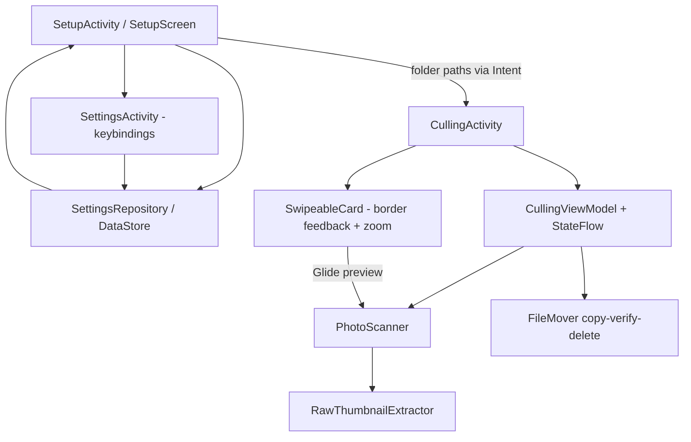

# Requirements

### Overview & Goals
Build **FoCull Point**, a simple photo-culling app for Android phones and tablets. The user reviews photos from a folder using Tinder-style swipe gestures and the app sorts them into Favorite / Reject folders while Skip leaves them for later. The app must handle RAW+JPEG pairs, file-name conflicts, persistent theme and keybinding settings, zoom, and device rotation.

### Scope
**In Scope**
- Folder Selection (start) screen with Quick and Advanced setup.
- Culling screen with swipe gestures (right = Favorite, left = Reject, up = Skip) and live colored border feedback.
- File engine: RAW/JPEG pairing, multi-extension support, safe file moving, conflict resolution, auto folder creation.
- Dark (true black / OLED) and Light (light grey) themes with persisted preference.
- Remappable keyboard shortcuts for Favorite / Skip / Reject with persisted config.
- Double-tap and pinch-to-zoom preview.
- Correct behavior on rotation (state preserved).
- Full-filesystem permission handling.

**Out of Scope**
- Cloud sync, editing, rating beyond favorite/reject/skip.
- Video culling.
- Undo history (not requested).

### User Stories
- As a photographer, I want to Quick-Setup a single folder so favorites/rejects folders are created automatically and I can start culling immediately.
- As an advanced user, I want to pick source, favorite, and reject folders manually so I control where photos go.
- As a user, I want to swipe right/left/up to favorite/reject/skip, with a colored glowing border telling me my pending choice before I lift my finger.
- As a user, I want RAW+JPEG pairs treated as one unit (preview the JPEG, move both together).
- As a user, I want to be asked what to do (Skip / Replace / Rename) when a file already exists at the destination.
- As a user, I want my theme and keyboard shortcuts remembered between launches.
- As a user, I want to zoom into a preview and to rotate my device without losing progress.
- As a user, I want a confirmation before the back button returns me to the setup screen, and a prompt to return to setup when culling finishes.

### Functional Requirements
1. **Start screen** is always the Folder Selection screen. Top-right has a Dark/Light toggle and a keyboard-settings icon.
2. **Quick Setup**: pick one folder; app uses it as source and auto-creates `Favorites` and `Rejects` subfolders (reusing them if they already exist).
3. **Advanced Setup**: pick source, favorite, and reject folders manually.
4. **Start Culling** button loads previewable items and opens the culling screen.
5. **Swipe gestures**: right = Favorite (green border), up = Skip (yellow border), left = Reject (red border). Border intensity follows drag distance; the action commits only when the touch actually ends (finger lifted). Releasing below threshold cancels.
6. **Skip** leaves the file in place and re-queues it to appear again after the rest are rated.
7. **RAW+JPEG pairing**: files sharing a base name are one pair; only the JPEG is previewed when present, otherwise the RAW's embedded JPEG thumbnail. Favorite/Reject move the whole pair.
8. **Extensions**: support common RAW formats (ARW, CR2, CR3, NEF, NRW, ORF, RAF, RW2, DNG, PEF, SRW, etc.) plus JPEG (jpg/jpeg) and common images (png, heic).
9. **Move**: Favorite/Reject move file(s) into the corresponding folder; safe against data loss.
10. **Conflict handling**: if a destination file with the same name exists, prompt Skip (do nothing) / Replace / Rename (auto intelligent rename so both coexist).
11. **Existing folders**: do not create duplicate Favorite/Reject folders if they already exist.
12. **Theme**: default Dark true-black; Light is light grey; persisted.
13. **Keybindings**: default arrow keys (right=Favorite, up=Skip, left=Reject), remappable and persisted.
14. **Zoom**: double-tap and pinch-to-zoom on preview.
15. **Rotation**: culling continues in the new orientation without restarting.
16. **Back during culling**: show a confirmation dialog before returning to setup.
17. **Completion**: when all items are culled, offer to return to the setup screen.

### Non-Functional Requirements
- File moves must be resilient (no partial/corrupt results, works across storage volumes).
- Smooth gesture/animation performance on phones and tablets.
- Works on Android minSdk 27 through targetSdk 36.

# Technical Design

### Current Implementation
The project is a bare Android template:
- `app/build.gradle.kts`: only `com.android.application` plugin, deps `appcompat`, `core-ktx`, `material`; **no Kotlin or Compose plugin**. minSdk 27, targetSdk 36, AGP 9.3.1.
- `AndroidManifest.xml`: `<application>` only, **no activities**, no permissions.
- No app Kotlin source (only sample unit/instrumented test files). Themes exist (`values/themes.xml`, `values-night/themes.xml`).

Everything below is greenfield and must be added.

### Key Decisions
- **UI toolkit: Jetpack Compose** (with Material 3) for gestures, animations, and theming.
- **Structure: Multi-Activity** — a `SetupActivity` (launcher) and a `CullingActivity`, each hosting Compose via `setContent`. State survives rotation via per-activity `ViewModel` + `StateFlow`; `android:configChanges` is NOT abused — ViewModels retain culling state.
- **File access: All-Files Access** — `MANAGE_EXTERNAL_STORAGE` (API 30+) / `WRITE_EXTERNAL_STORAGE` (API 27–29) with `java.io.File` for direct moves and folder creation.
- **Image loading: Glide** for JPEG/PNG previews and extracted RAW thumbnails, integrated into Compose via `AndroidView`/Glide-Compose glue.
- **RAW-only preview: embedded JPEG thumbnail** extracted from RAW metadata (via `ExifInterface`/embedded preview), falling back to a placeholder.
- **Move safety: copy-verify-delete** — copy bytes to destination, verify length, then delete source; works across volumes.
- **Persistence: Jetpack DataStore (Preferences)** for theme mode and keybindings.

### Proposed Changes
**Gradle / manifest**
- Add Kotlin, Compose compiler, and Compose BOM; add DataStore, `activity-compose`, `lifecycle-viewmodel-compose`, Glide.
- Manifest: declare `SetupActivity` (LAUNCHER) and `CullingActivity`; add `MANAGE_EXTERNAL_STORAGE`, `READ/WRITE_EXTERNAL_STORAGE` (maxSdk-scoped), `android:label="FoCull Point"`, `requestLegacyExternalStorage` for API 29.

**Setup flow (`SetupActivity`)**
- Compose screen with top-right theme toggle + keybind-settings icon.
- Quick/Advanced selectors using the system folder picker (`ACTION_OPEN_DOCUMENT_TREE` to obtain a path, resolved to `File`) plus a permission gate that routes to All-Files-Access settings if not granted.
- "Start Culling" launches `CullingActivity` with folder paths as Intent extras.

**Settings**
- `SettingsRepository` backed by DataStore exposing `themeMode` and `keyBindings` as flows.
- Keybinding editor screen (`SettingsActivity` or Compose dialog) capturing key events to remap Favorite/Skip/Reject.

**File engine (`filemanager` package)**
- `PhotoScanner`: scans source folder, groups files by base name into `PhotoItem` (pair-aware), selects preview file (JPEG > RAW embedded), filters by supported extensions.
- `Extensions`: central list of RAW/JPEG/image extensions.
- `FileMover`: `move(item, destination, conflictStrategy)` performing copy-verify-delete for each file in the pair; folder creation that reuses existing folders; conflict detection returning a result that the UI resolves (Skip/Replace/Rename) with intelligent rename (`name_1.ext`, incrementing).
- `RawThumbnailExtractor`: pulls embedded JPEG preview from RAW.

**Culling flow (`CullingActivity` + `CullingViewModel`)**
- ViewModel holds the queue, current index, and a skip re-queue list; exposes state via `StateFlow` (rotation-safe).
- `SwipeableCard` composable: tracks drag offset with `pointerInput`/`detectDragGestures`, maps offset to a border color+alpha (green/yellow/red), and commits the action only on drag-end above threshold; snaps back otherwise.
- Zoom via `detectTapGestures(onDoubleTap)` + `detectTransformGestures` (pinch), with graphicsLayer scale/translation.
- Physical keyboard handled via `onKeyEvent` mapped through persisted keybindings.
- Back press → confirmation dialog → finish to setup. Completion → dialog to return to setup.

### Data Models / Contracts
```kotlin
enum class CullAction { FAVORITE, REJECT, SKIP }
enum class ThemeMode { DARK, LIGHT }
enum class ConflictStrategy { SKIP, REPLACE, RENAME }

data class PhotoItem(
    val baseName: String,
    val files: List<File>,   // pair members (raw + jpeg, etc.)
    val previewFile: File    // jpeg if present else raw (embedded thumb)
)

data class KeyBindings(
    val favorite: Int = KeyEvent.KEYCODE_DPAD_RIGHT,
    val skip: Int = KeyEvent.KEYCODE_DPAD_UP,
    val reject: Int = KeyEvent.KEYCODE_DPAD_LEFT
)

interface FileMover {
    fun move(item: PhotoItem, destDir: File, strategy: ConflictStrategy?): MoveResult
}
sealed interface MoveResult { object Success; data class Conflict(val file: File): MoveResult; data class Error(val e: Throwable): MoveResult }
```

### File Structure
```
app/src/main/java/com/example/focullpointv2/
  ui/setup/SetupActivity.kt, SetupScreen.kt, SetupViewModel.kt
  ui/culling/CullingActivity.kt, CullingScreen.kt, SwipeableCard.kt, CullingViewModel.kt
  ui/settings/SettingsActivity.kt (keybindings)
  ui/theme/Theme.kt, Color.kt (true-black dark + light grey)
  data/SettingsRepository.kt (DataStore)
  filemanager/PhotoScanner.kt, FileMover.kt, RawThumbnailExtractor.kt, Extensions.kt
  model/PhotoItem.kt, CullAction.kt, KeyBindings.kt, enums
```

### Architecture Diagram


### Risks
- **MANAGE_EXTERNAL_STORAGE** requires user to grant special access via system settings; needs a clear gate and handling if denied.
- **RAW previews**: not all RAW files expose an embedded JPEG; must fall back gracefully.
- **Cross-volume moves** (SD card) — copy-verify-delete mitigates rename failures.
- **Gesture vs zoom conflict**: pinch/double-tap must not trigger a swipe; gate swipe when zoomed in.
- **AGP 9.x + Compose** version alignment in the version catalog.

# Testing

### Validation Approach
Verify each functional requirement through focused instrumented/unit checks on the file engine plus manual UI validation of gestures and theming. The file engine is the highest-risk area and gets unit test coverage.

### Key Scenarios
- **Pairing**: a folder with `IMG_1.JPG` + `IMG_1.ARW` produces one `PhotoItem` with the JPEG as preview and both files moved together.
- **RAW-only**: `IMG_2.NEF` alone produces one item previewed via embedded JPEG thumbnail (or placeholder).
- **Quick setup**: selecting a folder creates `Favorites`/`Rejects` only if absent; reuses them otherwise.
- **Move**: Favorite/Reject relocates all pair files to the correct folder via copy-verify-delete; source removed only after verified copy.
- **Skip**: file stays in place and re-appears after the rest are culled.
- **Swipe commit**: action commits only on touch-release above threshold; below threshold snaps back with no move; border color matches direction.
- **Persistence**: theme and keybindings survive app restart.
- **Rotation**: rotating during culling keeps the current item and progress.

### Edge Cases
- Destination already has a file with the same name → Skip / Replace / Rename dialog; Rename yields a non-colliding incremented name.
- Permission not granted → user is routed to grant All-Files Access; culling blocked until granted.
- Empty/no-supported-files folder → informative empty state.
- Zoomed-in preview does not trigger swipe actions.
- Cross-volume move (source and destination on different storage) succeeds.

### Test Changes
- Add JVM unit tests for `PhotoScanner` (pairing, extension filtering) and `FileMover` (copy-verify-delete, conflict rename) using temp dirs.
- Replace the sample test files with meaningful tests where relevant.

# Delivery Steps

### ✓ Step 1: Project foundation: Gradle, permissions, theme, settings persistence
The project compiles as a Compose app with All-Files-Access permissions, the FoCull Point name, both themes, and a working settings store.

- Add Kotlin + Compose plugins and dependencies (Compose BOM, `activity-compose`, `lifecycle-viewmodel-compose`, Glide, DataStore) to the version catalog and `app/build.gradle.kts`.
- Update `AndroidManifest.xml`: app label "FoCull Point", `MANAGE_EXTERNAL_STORAGE` + `READ/WRITE_EXTERNAL_STORAGE` (sdk-scoped), `requestLegacyExternalStorage`, and declare the activities.
- Create `ui/theme` with a true-black OLED dark scheme and a light-grey light scheme (`Theme.kt`, `Color.kt`).
- Implement `data/SettingsRepository.kt` backed by DataStore exposing `themeMode` and `keyBindings` flows with defaults (dark, arrow keys).
- Define core model/enums: `ThemeMode`, `CullAction`, `ConflictStrategy`, `KeyBindings`.

### ✓ Step 2: Folder Selection screen with Quick/Advanced setup and permission gating
The launcher screen lets the user pick folders (quick or advanced), toggle theme, open keybind settings, and start culling.

- Create `SetupActivity` (LAUNCHER) hosting `SetupScreen` + `SetupViewModel`.
- Top-right Dark/Light toggle bound to `SettingsRepository`, and a keyboard icon opening the settings screen.
- Quick Setup: single-folder picker; resolve to a `File`; plan auto-creation of `Favorites`/`Rejects` (reuse if present).
- Advanced Setup: separate pickers for source, favorite, and reject folders.
- Permission gate that routes the user to grant All-Files Access when missing and blocks Start until granted.
- "Start Culling" validates selections and launches `CullingActivity` with folder paths as extras.

### ✓ Step 3: Keyboard shortcut settings screen
The user can view and remap Favorite/Skip/Reject keys, persisted across launches.

- Create `SettingsActivity`/`SettingsScreen` reachable from the setup screen's keyboard icon.
- Show current bindings (default arrow keys) and capture key presses to remap each action.
- Persist bindings via `SettingsRepository` and reflect changes immediately.
- Handle conflicts (same key for two actions) with validation.

### ✓ Step 4: File engine: scanning, pairing, RAW thumbnails, safe move, conflict resolution
A tested engine scans folders, pairs RAW+JPEG, previews correctly, and moves files safely with conflict handling.

- `filemanager/Extensions.kt`: central lists of RAW (ARW, CR2, CR3, NEF, NRW, ORF, RAF, RW2, DNG, PEF, SRW, ...), JPEG, and other image extensions.
- `PhotoScanner`: group files by base name into `PhotoItem`, choose preview (JPEG > RAW), filter unsupported files.
- `RawThumbnailExtractor`: extract embedded JPEG preview from RAW, fallback to placeholder.
- `FileMover`: copy-verify-delete move of all pair files; create/reuse destination folders; detect conflicts and return a result the UI resolves; implement intelligent incremental rename.
- Add JVM unit tests for pairing, extension filtering, and move/rename logic using temp directories.

### ✓ Step 5: Culling screen: swipe gestures, border feedback, zoom, keyboard, rotation, dialogs
The user culls photos with Tinder-style swipes, live colored borders, zoom, keyboard shortcuts, and safe navigation.

- Create `CullingActivity` + `CullingViewModel` holding the queue, current index, and skip re-queue in `StateFlow` (rotation-safe).
- `SwipeableCard` composable tracking drag offset; map to border color/alpha (green=Favorite, yellow=Skip, red=Reject); commit action only on touch-release above threshold, snap back otherwise.
- Wire actions to `FileMover`; show Skip/Replace/Rename dialog on conflicts; Skip re-queues the item to reappear at the end.
- Preview rendering with Glide; double-tap and pinch-to-zoom via transform gestures (disable swipe while zoomed).
- Physical keyboard handling through persisted `KeyBindings`.
- Back press confirmation dialog returning to setup, and a completion dialog offering to return to setup when the queue is empty.